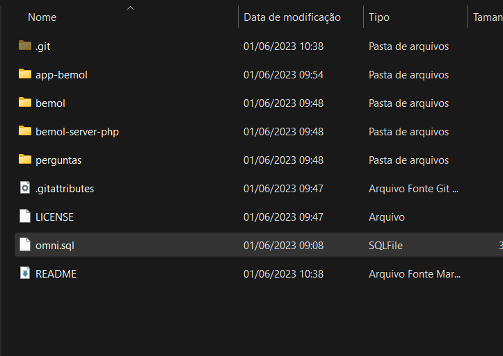
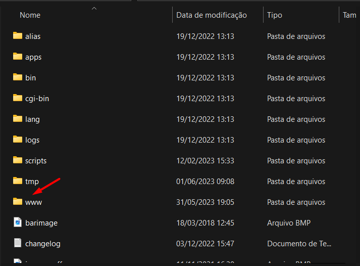
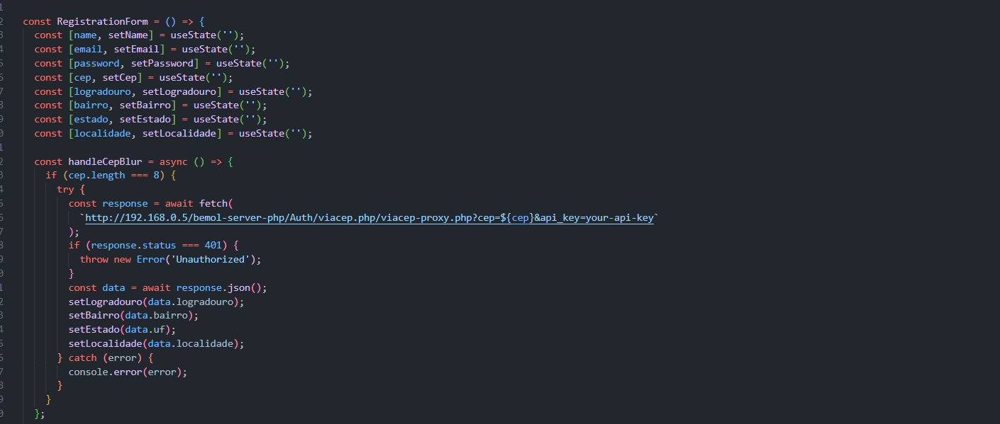
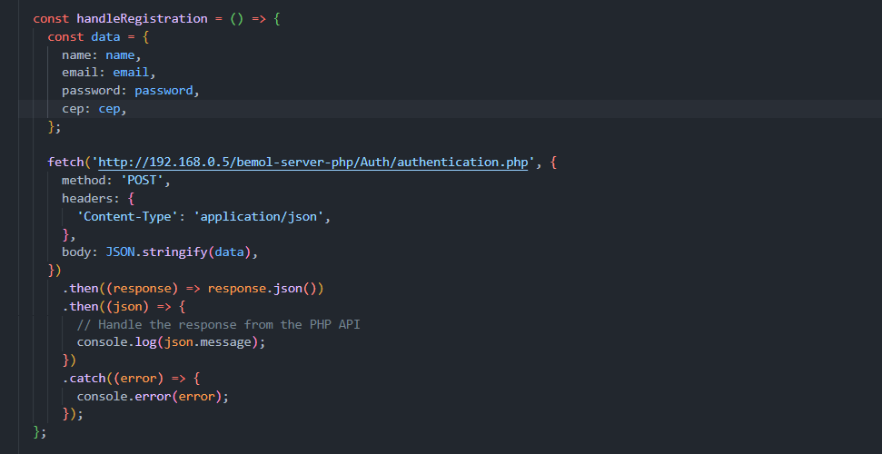

# Omnichannel

<h2>Objetivo</h2>

Tendo em vista a necessidade do omnichannel, fora criado um aplicativo e um site que recebem suas informações de um mesmo banco de dados.
 Assim, temos uma transição suave entre os dois, sem necessidade de repetição, criando assim uma navegação fluída entre o site e o app.

<h2>Instruções</h2>
<ul>
  <li>Implementar o Schema do Omni no BD(MySQL)</li>
  
  <li>Colocar as pastas "app-bemol", "bemol-server-php" e "bemol" na pasta www do wamp</li>
  
  <li>Alterar o IP de Requisição das APIS do arquivo "App.tsx" da pasta "app-bemol" para o da sua rede.</li>
  
  
</ul>

<h2>Agradecimentos</h2>

Acabei por aprender muito com o desafio e sou grato pela oportunidade de fazê-lo, espero que possamos continuar e que eu possa colaborar com a equipe futuramente.

